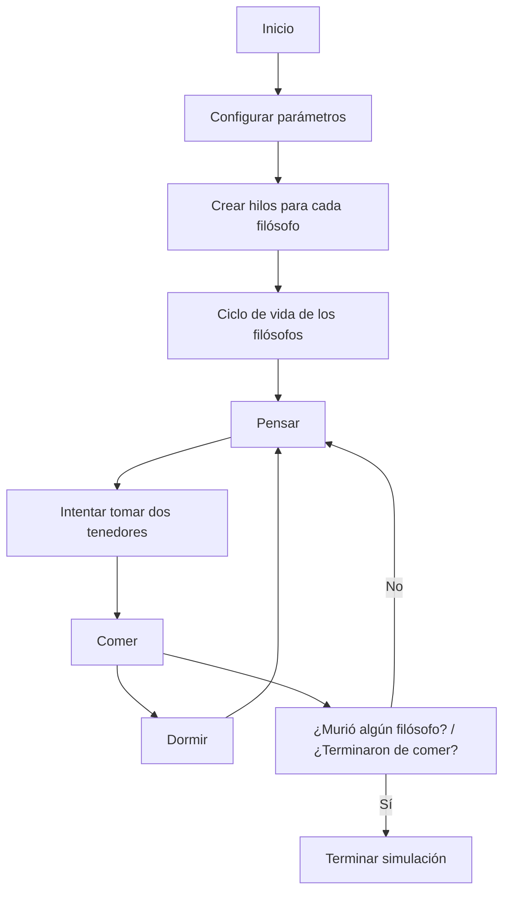

# Philosophers  

### 🏆 **42 Project**  

**Philosophers** es uno de los proyectos más interesantes en 42. Basado en el clásico problema de los *filósofos cenando*, este proyecto me permitio poner a prueba y mejorar mis habilidades en concurrencia y sincronización. A través de este proyecto, he implementado una simulación eficiente donde múltiples hilos representan filósofos que comparten recursos limitados de forma segura y sin errores.

---

## 🎯 *Objetivo del proyecto*
El objetivo principal fue crear una simulación multihilo que modele cómo los filósofos alternan entre pensar, comer y dormir, todo mientras compiten por recursos limitados: **los tenedores 🍴😨**. Este proyecto me ayudó a comprender profundamente conceptos como:
- La sincronización entre procesos mediante mutexes.
- La prevención de *deadlocks* y condiciones de carrera.
- La gestión eficiente de múltiples hilos para lograr un programa robusto y escalable.
- Mejorar mi estructuración modular, y escalable en proyectos complejos. 

---

## ❓ *¿En qué consiste el problema de los filósofos cenando?*

El problema de los filósofos cenando es un problema clásico en programacion, en el que te desafia en problemas como la sincronización y la gestión de recursos compartidos en un entorno concurrente.  

Imagina a un grupo de filósofos sentados alrededor de una mesa circular en la que hay un gran e infinito bol de espaguetis 🍝. Cada filósofo alterna entre tres estados: comer, dormir y pensar. Para comer, cada filósofo necesita dos tenedores, pero a cada filosofo se le asigna un unico tenedor a su izquierda. Esto crea un problema:  
1. Si todos los filósofos intentan tomar sus tenedores al mismo tiempo, puede ocurrir un *deadlock*, ya que nadie puede avanzar.  
2. Si no hay una sincronización adecuada, algunos filósofos podrían quedarse hambrientos indefinidamente (condición de inanición ☠️). 

La solución a este problema implica diseñar estrategias de sincronización para garantizar que los filósofos puedan comer sin bloqueos ni inanición de la forma mas optima posible.

---

## 🚀 *Características principales*  
1. **Multihilo:** Cada filósofo se ejecuta como un hilo independiente, funcionando de manera concurrente.
2. **Sincronización segura:** Usé mutexes para garantizar accesos exclusivos a los recursos compartidos.
3. **Prevención de bloqueos:** Implementé estrategias efectivas para evitar que los filósofos quedaran en espera infinita.
4. **Finalización configurable:** El programa puede terminar cuando todos los filósofos han comido un número específico de veces (si se proporciona este parámetro).

---

## 📁 *Estructura del proyecto*  
```bash
Philosophers/
├── philo.c           # Lógica principal del programa
├── philo_routine.c   # Rutinas de los filósofos (pensar, comer, dormir)
├── check_end.c       # Verificaciones y condiciones de fin
├── philo.h           # Definiciones y cabeceras
├── Makefile          # Herramienta de compilación
└── README.md         # Este documento
```

## 📖 *Funcionamiento técnico*  
Filosofía detrás del código  
Cada filósofo alterna entre tres estados: comer, dormir y su defecto pensar.
Para comer, necesita tomar dos tenedores, que están representados como mutexes.

La simulación termina en dos casos:
- Si un filósofo no logra comer antes de su tiempo límite, el filósofo muere por inanición y el programa finaliza de manera limpia.
- Si todos los filósofos han comido el número especificado de veces (si se configuró).

Sincronización  
La clave para evitar problemas como deadlocks o condiciones de carrera fue sincronizar cuidadosamente los accesos a los tenedores usando mutexes. También me aseguré de implementar una lógica que prioriza la seguridad y la consistencia en la ejecución de cada hilo.

## 📊 *Diagrama del flujo*


## 🛠️ **Instrucciones de instalación**

1. Clona el repositorio:
   ```bash
   git clone https://github.com/AdrianPMiro/philosophers_42.git && cd philosophers_42
   ```

2. Compila el proyecto:

   ```bash
   make
   ```

## 💻 *Cómo usar*  
1. Instalación  
Para probar la simulación, primero clona el repositorio y compila el proyecto:
```bash
Copiar código
git clone https://github.com/tu_usuario/philosophers.git  
cd philosophers  
make
```

2. Ejecución  
Lanza la simulación con los parámetros deseados:  
```bash
Copiar código
./philo <número_de_filósofos> <tiempo_para_morir> <tiempo_para_comer> <tiempo_para_dormir> [número_de_comidas]
Parámetros:
```
Ejemplo: 
```bash
./philo 5 800 200 200 5
```

- <número_de_filósofos>: Cantidad de filósofos en la mesa.
- <tiempo_para_morir>: Tiempo máximo (en ms) antes de que un filósofo muera de hambre.
- <tiempo_para_comer>: Tiempo que tarda un filósofo en comer.
- <tiempo_para_dormir>: Tiempo que un filósofo pasa durmiendo.
- [número_de_comidas] (opcional): Número de comidas necesarias para que cada filósofo termine su participación.


## ✨ *Conclusión*  
Trabajar en este proyecto fue un verdadero desafío, pero también una experiencia enriquecedora. Philosophers no solo me permitió profundizar en temas avanzados como concurrencia y sincronización, sino que también me enseñó la importancia de escribir código limpio y estructurado para manejar sistemas complejos.

---

   ```
 /\_/\                                /\_/\  
( o.o )   ñam ñam                    ( -.- )  *vaya PLATÓN de espaguetis me voy a meter*  
 > ^ <                                > ^ <

```
